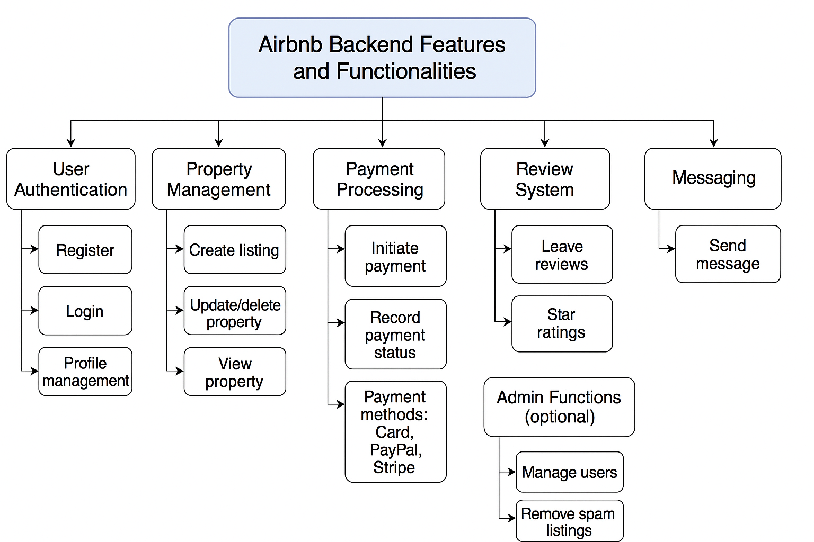

# alx-airbnb-project-documentation
# Airbnb Clone Backend - Features and Functionalities

This document outlines the key features and functionalities required for the backend system of the Airbnb Clone project. The architecture is designed to mimic the essential operations of Airbnb, ensuring a scalable and maintainable backend.

---

##  Overview

The diagram below provides a high-level view of the core backend components and how they interact. This includes systems for managing users, properties, bookings, payments, and more.

---

##  Core Features

### User Authentication
- **User Registration and Login**
- **JWT Token-based Authentication**
- **User Profile Management**
- **Role Management**: Guest, Host, Admin

### Property Management
- **Create and Update Listings**
- **Set Property Details**: Description, Price, Location
- **Manage Availability**

###  Booking System
- **Make Reservations**
- **Cancel/Update Bookings**
- **Check-in / Check-out Tracking**

###  Payment Processing
- **Initiate and Confirm Payments**
- **Support Multiple Payment Methods**: Credit Card, PayPal, Stripe
- **Payment History and Status Tracking**

###  Review System
- **Leave Reviews for Properties**
- **Star Ratings (1-5)**
- **Moderation by Admins (optional)**

###  Messaging (Optional)
- **Host–Guest Communication**
- **Inbox and Outbox Support**

###  Admin Panel (Optional)
- **User Management**
- **Listing Moderation**
- **System Monitoring**

---

##  Directory Structure

---

## Tools Used

- **Draw.io** for diagram creation
- **Markdown** for structured documentation
- **GitHub** for version control and collaboration

---

##  Purpose

This documentation ensures a clear understanding of the functional scope of the Airbnb Clone project and supports developers in building and extending the backend system efficiently.

